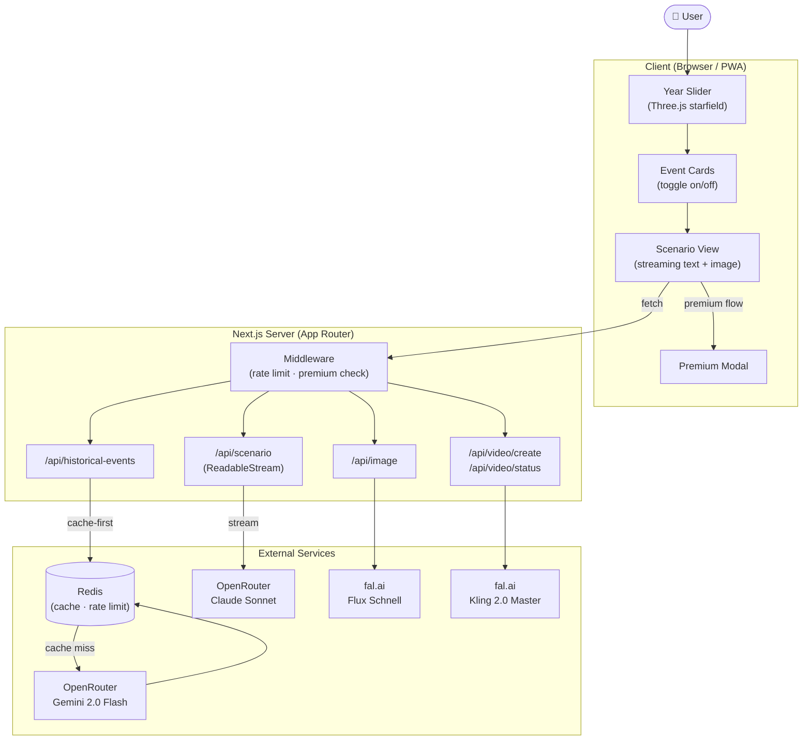

# Time Machine — AI Alternative History PWA

[](https://github.com/nekontachik/time_machine/actions/workflows/ci.yml)
[](./coverage/index.html)
[](./LICENSE)
[](https://time-machine-mu.vercel.app/)

> 🌍 **[Try it live → time-machine-mu.vercel.app](https://time-machine-mu.vercel.app/)**

https://github.com/user-attachments/assets/e35a1360-2a20-4105-a0d3-989c63cf1e58

An AI-powered Progressive Web App that lets users explore alternative history scenarios. Pick a historical year, toggle which events happened or didn't, and get a vivid AI-generated narrative with cinematic imagery and video.

## Features

- **Year Explorer** — slider spanning 3000 BCE to 2024 CE with Three.js starfield animation
- **AI Event Generation** — top-3 events for any year via Gemini 2.0 Flash (OpenRouter)
- **Streaming Scenarios** — real-time alternative history narratives via Claude Sonnet (OpenRouter)
- **AI Image Generation** — cinematic scene images via Flux Schnell (fal.ai)
- **AI Video Generation** — image-to-video via Kling 2.0 (fal.ai), with mock mode for development
- **Rate Limiting** — per-IP daily limits with Redis, fail-open when Redis is unavailable
- **i18n** — Ukrainian and English via next-intl
- **PWA** — installable with offline support via service worker

## Lighthouse Scores

| Metric | Mobile | Desktop |
|--------|--------|---------|
| 🟢 Performance | **95** | **100** |
| 🟢 Accessibility | **93** | **93** |
| 🟢 Best Practices | **100** | **100** |
| 🟢 SEO | **100** | **100** |
| FCP | 1.4 s | 0.2 s |
| LCP | 2.4 s | 0.4 s |
| TBT | 0 ms | 10 ms |
| CLS | 0 | 0 |

_Measured with Lighthouse 13.0.1 via PageSpeed Insights · March 2026_

## Tech Stack

| Layer | Technology |
|-------|-----------|
| Framework | Next.js 14 (App Router), TypeScript strict |
| Styling | Tailwind CSS |
| 3D | Three.js (lazy-loaded starfield) |
| AI Text | OpenRouter API (Gemini 2.0 Flash + Claude Sonnet) |
| AI Images | fal.ai (Flux Schnell) |
| AI Video | fal.ai (Kling 2.0 Master) |
| Cache | Redis (ioredis) |
| i18n | next-intl v3 |
| Testing | Vitest (unit/API) + Playwright (E2E) |
| CI | GitHub Actions |

## Getting Started

### Prerequisites

- Node.js 20+
- Redis instance (optional — app works without it, rate limiting is bypassed)

### Installation

```bash
git clone https://github.com/nekontachik/time_machine.git
cd time-machine
npm install
```

### Environment Variables

Copy the example and fill in your keys:

```bash
cp .env.local.example .env.local
```

| Variable | Required | Description |
|----------|----------|-------------|
| `OPENROUTER_API_KEY` | Yes | Text generation (events + scenarios) |
| `FAL_KEY` | Yes | Image + video generation via fal.ai |
| `REDIS_URL` | No | Cache + rate limiting (fail-open without) |
| `RATE_LIMIT_FREE` | No | Free requests per day per IP (default: 3) |
| `NEXT_PUBLIC_APP_URL` | No | App URL for OG meta (default: http://localhost:3000) |
| `NEXT_PUBLIC_SENTRY_DSN` | No | Sentry error monitoring DSN |
| `SENTRY_AUTH_TOKEN` | No | Sentry source map upload (CI/Vercel only) |

### Development

```bash
npm run dev
# or clean start (removes .next cache):
npm run dev:clean
```

Open [http://localhost:3000](http://localhost:3000).

## Testing

### Unit & API Tests (Vitest)

```bash
npm test              # single run
npm run test:watch    # watch mode
npm run test:coverage # with coverage report
```

200 tests across 22 files. Key areas covered:

- **lib/ai/image** — `FalAuthError` classification, retry logic, auth bail-out, placeholder fallback (98% coverage)
- **lib/ai/text** — event generation, context enrichment, streaming scenario output (100% coverage)
- **lib/ai/video-prompt** — scenario type detection, motion prompt generation, word limits
- **lib/video-providers/kling** — mock mode task lifecycle (create → poll → complete)
- **lib/infrastructure** — Redis fail-open, rate limiting, per-IP extraction
- **API routes** — input validation, error codes, rate limiting, premium gating
- **streamScenario** — chunk streaming, premium city/country context injection, empty stream handling

### E2E Tests (Playwright)

```bash
npm run test:e2e      # headless
npm run test:e2e:ui   # interactive UI
```

Tests cover:

- Home page rendering and navigation
- API contract validation (error codes, required fields)
- Accessibility audit (WCAG 2.1 AA via axe-core)
- Performance budgets (LCP, FCP, TBT thresholds)
- Responsive design (mobile viewport)

### Testing Strategy

This project uses AI providers (OpenRouter, fal.ai) for core functionality. The testing approach accounts for this:

- **External AI calls are mocked** — `lib/ai/text.ts` and `lib/ai/image.ts` are mocked at the API route level because calling real AI APIs in CI would be slow, expensive, and non-deterministic. This is intentional and reflected in the coverage report.
- **Pure logic is tested directly** — prompt builders (`buildFluxPrompt`, `buildMotionPrompt`), error normalisation, scenario type detection, and input validation are tested with real assertions.
- **Infrastructure gracefully degrades** — Redis, rate limiting, and premium checks are tested for fail-open behavior when dependencies are unavailable.
- **API contracts are validated at two levels** — Vitest tests mock the AI layer and verify route-level logic (validation, error codes, rate limiting). Playwright E2E tests hit the running server to verify HTTP contracts independently.

### AI Quality Evaluation

```bash
npm run eval          # run evaluation harness against live AI providers
```

Tests 10 historically significant years for event accuracy, structure compliance, latency, and runs a Claude vs Gemini comparison for scenario quality. See [`scripts/eval-harness.ts`](scripts/eval-harness.ts).

**Latest results (April 2026):**

| Metric | Result |
|--------|--------|
| Event accuracy (keyword match) | **93.0%** across 10 benchmark years |
| Structure compliance (valid JSON) | **10/10** — zero failures |
| Average event latency | **883ms** (Gemini 2.0 Flash) |

Provider comparison for scenario generation (year 1969, "Apollo 11 fails"):

| Provider | Paragraphs | Length | Readability | Latency |
|----------|-----------|--------|-------------|---------|
| Claude Sonnet | 4 (expected 3) | 2383 chars | 26.7 words/sentence | 2893ms |
| Gemini Flash | 3 (correct) | 2048 chars | 16.9 words/sentence | 781ms |

Claude produces richer, more literary narratives but occasionally exceeds structure constraints. Gemini follows instructions precisely and is 3.7× faster — confirming the architectural decision to use Gemini for structured data and Claude for creative writing.

## API Routes

| Route | Method | Description |
|-------|--------|-------------|
| `/api/historical-events` | GET | Top-3 events for a year (Redis cache-first) |
| `/api/scenario` | POST | Streaming alternative history narrative |
| `/api/image` | POST | AI image generation (Flux via fal.ai) |
| `/api/video/create` | POST | Start video generation task (premium) |
| `/api/video/status` | GET | Poll video task status (premium) |

## Architecture



**Server/Client Boundary:** All `lib/` files using Node.js APIs import `server-only`. Client components (`"use client"`) communicate with server code exclusively through API routes.

```
app/
├── api/                    # Server-side API routes
├── events/[year]/          # Dynamic events page (SSR + client)
├── scenario/               # Scenario display (streaming + image)
└── page.tsx                # Home (year slider + starfield)

components/
├── YearSection/            # Slider + Three.js starfield
├── ScenarioStream/         # Streaming text + image display
├── EventCard/              # Event toggle cards
└── ...                     # ShareCard, PremiumModal, i18n toggle

lib/
├── ai/
│   ├── text.ts             # OpenRouter text generation (server-only)
│   ├── image.ts            # fal.ai image generation (server-only)
│   ├── search.ts           # Tavily web search (server-only)
│   └── video-prompt.ts     # Motion prompt builder
├── infrastructure/
│   ├── redis-client.ts     # Redis cache client (server-only)
│   ├── rate-limit.ts       # Per-IP rate limiting (server-only)
│   └── cache.ts            # Event cache wrapper (server-only)
├── video-providers/
│   └── kling.ts            # Kling video via fal.ai (server-only)
├── premium.ts              # Premium status check (server-only)
└── formatYear.ts           # Year formatting utility
```

## Why These Technologies?

| Decision | Rationale |
|----------|-----------|
| **OpenRouter over direct API SDKs** | Provider-agnostic gateway — switch models without code changes. One API key, unified billing, automatic failover. See [ADR-001](docs/adr/001-openrouter-over-direct-apis.md) |
| **Gemini Flash for events, Claude Sonnet for narratives** | Events need speed + structured JSON (Gemini Flash: ~0.3s, $0.10/1M tokens). Narratives need literary quality (Claude Sonnet: noticeably better creative writing). Splitting models saves ~60% on text costs |
| **fal.ai (Flux Schnell) over DALL-E** | 5× cheaper per image ($0.003 vs $0.016), comparable quality for cinematic scenes, sub-3s generation. See [ADR-004](docs/adr/004-flux-over-dalle.md) |
| **Fail-open architecture** | Every external dependency can fail. Redis down → rate limiting bypassed. fal.ai error → placeholder image. Stream cut off → show whatever arrived. Users never see a blank screen. See [ADR-002](docs/adr/002-fail-open-architecture.md) |
| **Redis with 24h TTL** | Same year = same events. Caching historical events cuts AI costs by ~80% for repeat requests. Fail-open when Redis is unavailable. See [ADR-003](docs/adr/003-redis-caching-strategy.md) |
| **`server-only` import enforcement** | Hard boundary between server and client code. CI script (`check-server-only.sh`) blocks merges if any `lib/` file using Node.js APIs lacks the import |

## Cost Per Request

| Operation | Provider | Model | Cost |
|-----------|----------|-------|------|
| Event generation | OpenRouter | Gemini 2.0 Flash | ~$0.0002 (512 tokens) |
| Event enrichment (×3) | OpenRouter | Gemini 2.0 Flash | ~$0.0004 (256 tokens × 3) |
| Web search (×3) | Tavily | — | ~$0.003 |
| Scenario narrative | OpenRouter | Claude Sonnet | ~$0.018 (2048 tokens) |
| Image generation | fal.ai | Flux Schnell | ~$0.003 |
| **Total (free tier)** | | | **~$0.025** |
| Video generation | fal.ai | Kling 2.0 | ~$0.10 (premium only) |

_At 100 daily users (3 requests each): estimated ~$7.50/day for text+image, with caching reducing repeat requests significantly._

## Architecture Decision Records

Detailed rationale for key technical decisions lives in [`docs/adr/`](docs/adr/):

- [ADR-001: OpenRouter over direct APIs](docs/adr/001-openrouter-over-direct-apis.md)
- [ADR-002: Fail-open architecture](docs/adr/002-fail-open-architecture.md)
- [ADR-003: Redis caching strategy](docs/adr/003-redis-caching-strategy.md)
- [ADR-004: Flux Schnell over DALL-E](docs/adr/004-flux-over-dalle.md)
- [ADR-005: Testing strategy for AI outputs](docs/adr/005-testing-strategy-for-ai.md)

## License

MIT
